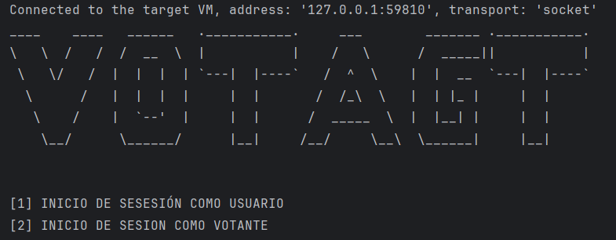

# VOTAGT

VotaGT es un sistema de software diseñado para facilitar y gestionar procesos de votación de manera eficiente y segura.
Su propósito principal es ofrecer una plataforma confiable para llevar a cabo diferentes tipos de votaciones, desde
elecciones políticas hasta encuestas comunitarias.

## Libreria base para el mapeo de objetos como archivos de texto plano
[GitHub - AlexanDev_CWA - ORMFile (Click Here)](https://github.com/alexandevcwa/ORMFile)